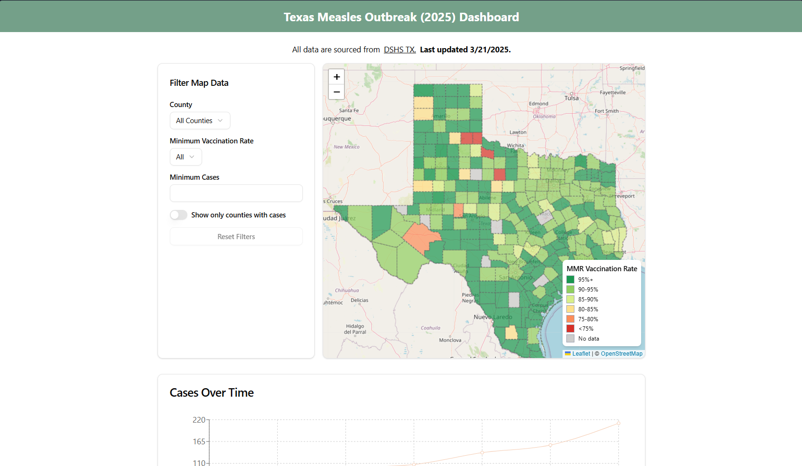

<div align="center">
  <h1>Measles Dashboard</h1>
  
  <a href="https://www.typescriptlang.org/" target="_blank">
    
  </a>
  <a href="https://vercel.com" target="_blank">
    
  </a>
  <a href="https://opensource.org/licenses/MIT" target="_blank">
    
  </a>
  <a href="https://img.shields.io/github/stars/gauravfs-14/measles-dashboard" target="_blank">
    
  </a>
  <a href="https://img.shields.io/github/forks/gauravfs-14/measles-dashboard" target="_blank">
    
  </a>
  <a href="https://img.shields.io/github/issues/gauravfs-14/measles-dashboard" target="_blank">
    
  </a>
  <a href="https://img.shields.io/github/last-commit/gauravfs-14/measles-dashboard" target="_blank">
    
  </a>
  <a href="https://doi.org/10.5281/zenodo.17210857">
    
  </a>

</div>

---

A comprehensive dashboard application for visualizing and analyzing measles outbreak data. This project provides public health officials, researchers, and the general public with up-to-date information on measles cases, vaccination rates, and outbreak trends.

The live dashboard can be accessed here: [https://measles-dashboard.vercel.app/](https://measles-dashboard.vercel.app/)

If you use our project, please cite the repository.
```bibtex
@software{gaurab_chhetri_2025_17210857,
  author       = {Gaurab Chhetri},
  title        = {gauravfs-14/measles-dashboard: v1.0.0},
  month        = sep,
  year         = 2025,
  publisher    = {Zenodo},
  version      = {v1.0.0},
  doi          = {10.5281/zenodo.17210857},
  url          = {https://doi.org/10.5281/zenodo.17210857},
  swhid        = {swh:1:dir:f8cdd92969a9df100a9274707678054b89e7e8ec
                   ;origin=https://doi.org/10.5281/zenodo.17210856;vi
                   sit=swh:1:snp:cf015c14b04e14f6ce96d2126719dd15a96b
                   bfe9;anchor=swh:1:rel:9a83de9f0191038d2215651fb5f2
                   66bfc209dde3;path=gauravfs-14-measles-
                   dashboard-69ef6cf
                  },
}
```

## Table of Contents

- [Features](#features)
- [Screenshots](#screenshots)
- [Technologies Used](#technologies-used)
- [Getting Started](#getting-started)
- [Data Sources](#data-sources)
- [Project Structure](#project-structure)
- [Deployment](#deployment)
- [FAQs](#faqs)
- [Acknowledgments](#acknowledgments)
- [License](#license)
- [Contributing](#contributing)

## Features

- **Measles Case Tracking**: Visualize measles cases using interactive charts and graphs.
- **Interactive Maps**: Explore outbreak locations with vaccination rates and case data.
- **Vaccination Rate Analysis**: View vaccination rates categorized by counties and age groups.
- **Historical Data Trends**: Compare historical data to analyze trends over time.
- **Mobile-Responsive Design**: Access the dashboard seamlessly across devices.
- **Customizable Filters**: Filter data by county, vaccination rates, and other parameters to tailor the view.

## Screenshots


_Preview of the dashboard interface._

## Technologies Used

- **Framework**: Next.js/ React.js
- **Programming Language**: TypeScript/ JavaScript
- **Styling**: Tailwind CSS/ ShadCN
- **Data Visualization**: recharts
- **State Management**: React Context API
- **Hosting**: Vercel

## Getting Started

First, install the dependencies:

```bash
npm install
```

Then, run the development server:

```bash
npm run dev
# or
yarn dev
# or
pnpm dev
# or
bun dev
```

Open [http://localhost:3000](http://localhost:3000) with your browser to see the dashboard.

## Data Sources

This dashboard uses data from Texas Department of State Health Services (DSHS TX): [https://www.dshs.texas.gov/news-alerts](https://www.dshs.texas.gov/news-alerts)

## Project Structure

- **Components**: Reusable UI components and panels for displaying data (e.g., maps, charts, filters).
- **Hooks**: Custom React hooks for fetching and processing data.
- **Context**: Context providers for managing global state (e.g., filters, map data).
- **Data**: JSON files containing preprocessed data for visualization.

## Deployment

The project is hosted on Vercel for fast and reliable deployment. To deploy your own version:

1. Fork the repository.
2. Connect your forked repository to Vercel.
3. Deploy directly from the Vercel dashboard.

## FAQs

**Q: How often is the data updated?**  
A: The data is updated manually whenever new information is available.

**Q: Can I contribute to this project?**  
A: Yes! Contributions are welcome. Please see the [Contributing](#contributing) section for details.

## Acknowledgments

- Data provided by the Texas Department of State Health Services.
- Map visualizations powered by Leaflet.
- Special thanks to [AIT Lab](https://ait-lab.vercel.app) for their support.

## License

This project is licensed under the MIT License. See the [LICENSE](LICENSE) file for details.

## Contributing

Contributions are welcome! Please feel free to submit a Pull Request.

---

Developed by: [Gaurab Chhetri](https://github.com/gauravfs-14), Supported by [AIT Lab](https://ait-lab.vercel.app).
